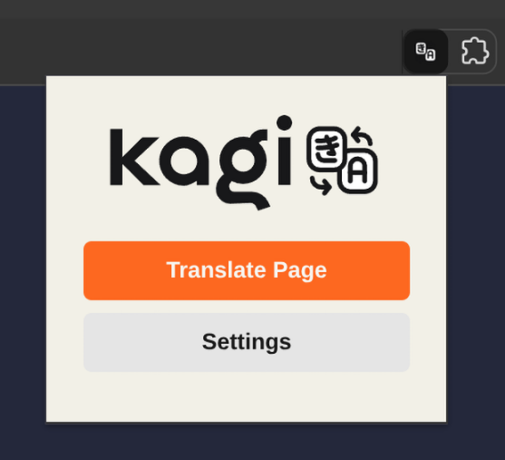
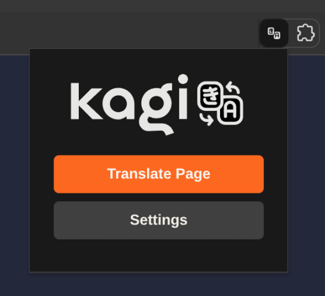
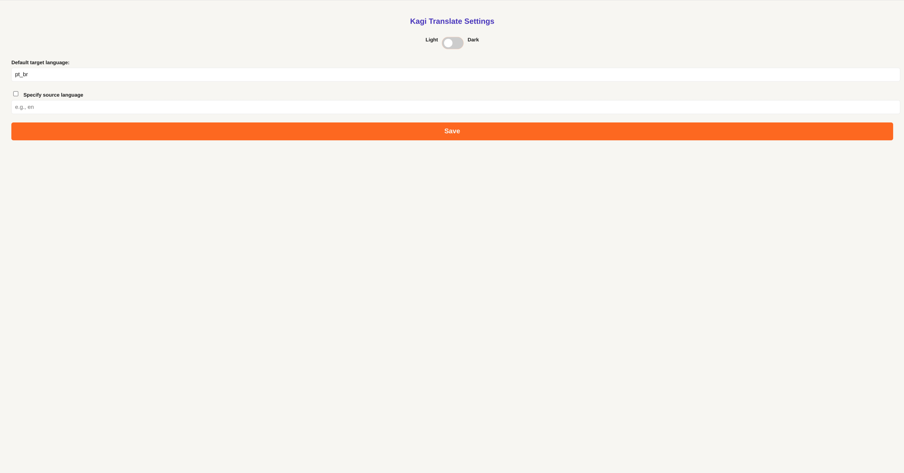

# Kagi Translate Extension

A simple and powerful browser extension to translate selected text or full pages using [Kagi Translate](https://kagi.com/translate).

## Features

- **Full-Page Translation**: Translate an entire webpage with a single click on the extension icon.
- **Selected Text Translation**: Highlight any text, right-click, and choose "Translate with Kagi" to get an instant translation.
- **Customizable Target Language**: Set a default language (e.g., `pt_br`) for all your translations.
- **Customizable Source Language**: Optionally specify a source language to improve translation accuracy, or let Kagi detect it automatically.
- **Light & Dark Mode**: The extension interface adapts to your preferred theme for a comfortable viewing experience.
- **No Kagi Account Required**: Use the power of Kagi Translate without needing an account.

## How to Use

### Translating a Full Page

1. Navigate to the page you want to translate.
2. Click the Kagi Translate icon in your browser's toolbar.
3. Click the "Translate Page" button.

### Translating Selected Text

1. Highlight the text you want to translate on any webpage.
2. Right-click on the selected text.
3. Select "Translate with Kagi" from the context menu.

### Configuration

1. Click the Kagi Translate icon in your browser's toolbar.
2. Click the "Settings" button.
3. From the options page, you can:
    - Set your default target and source languages.
    - Switch between light and dark themes.

## Screenshots

Here you can see the extension in action.

**Extension Popup (Light Mode)**

**Extension Popup (Dark Mode)**

**Options Page**

